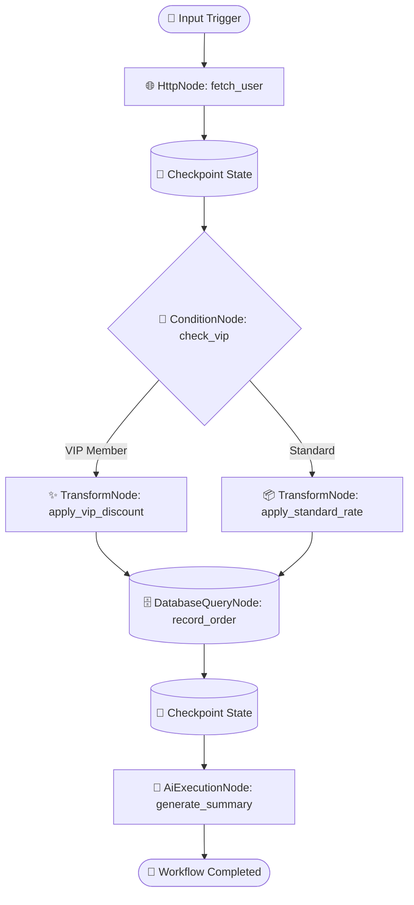

[🇸🇦 العربية](README.ar.md) | [🇬🇧 English](README.md)

# 🔀 eidcloud-workflow

> Declarative JSON/YAML workflow automation engine with state machine checkpointing, variable interpolation, and step branching in pure PHP 8.2+ (Zero external vendor dependencies).

[](https://github.com/eidcloud/eidcloud-workflow/releases)
[](https://www.php.net)
[](LICENSE)
[](.github/workflows/ci.yml)
[](#)
[](https://colab.research.google.com/github/eidcloud/eidcloud-workflow/blob/main/notebooks/quickstart.ipynb)

---

## 💡 Overview

**eidcloud-workflow** is a lightweight, high-performance, self-hosted alternative to n8n, Temporal, and Apache Airflow written in pure, native PHP 8.2+. It provides a declarative JSON and YAML workflow orchestration engine equipped with:

- **State Machine with Checkpointing:** Persists state after every step and seamlessly resumes failed workflows right from their checkpoint.
- **Node-Based Step Chaining:** First-class support for HTTP requests, Database queries (PDO/SQLite/MySQL), Conditional branching (If/Else, Switch), Data transformation, Parallel execution, and AI LLM prompt completions.
- **Dynamic Variable Interpolation:** Reactive expression engine (`{{steps.fetch_user.data.email ?? 'guest@example.com'}}`).
- **Resilience Engineering:** Built-in automatic retries with exponential backoff and randomized jitter, error fallback handlers, and step timeouts.
- **Zero External Dependencies:** Runs everywhere on standard PHP 8.2+ without bloated vendor directories or foreign daemons.

---

## 🏗️ Architecture & Flow



---

## ⚡ Core Capabilities

| Capability | Description |
| :--- | :--- |
| **Declarative Formats** | Supports both `.json` and `.yaml` workflow definitions with strict schema validation. |
| **State Persistence** | Atomic checkpointing after each step with resume capabilities (`--resume=<id>`). |
| **Variable Engine** | Dot-notated path navigation with null coalescing (`??`), math expressions, and JSON extraction. |
| **Node Ecosystem** | `http`, `database`, `condition`, `transform`, `ai`, `loop`, and `parallel`. |
| **Extensible** | Register custom domain nodes with `NodeFactory::register('custom_type', CustomNode::class)`. |
| **CLI & Programmatic API** | Full-featured command-line executable (`bin/eidcloud-flow`) and clean PHP SDK. |

---

## 🚀 Quickstart & Installation

Clone repository directly:
```bash
git clone https://github.com/eidcloud/eidcloud-workflow.git
cd eidcloud-workflow
```

Or install via Composer:
```json
{
  "require": {
    "eidcloud/workflow": "^1.0.0"
  }
}
```

Verify your setup by running the test suite:
```bash
php tests/run_tests.php
```

---

## 💻 CLI Usage

The `bin/eidcloud-flow` CLI provides comprehensive workflow orchestration tools:

### 1. Validate a Workflow
```bash
php bin/eidcloud-flow validate examples/order_processing.json
```

### 2. Run a Workflow with Inputs
```bash
php bin/eidcloud-flow run examples/order_processing.json \
  --input='{"orderId": "ORD-991", "userId": 42, "amount": 125.50}' \
  -v
```

### 3. Inspect Checkpoints and History
```bash
php bin/eidcloud-flow history --workflow=order_processing
```

### 4. Resume from a Failure Checkpoint
```bash
php bin/eidcloud-flow run examples/order_processing.json --resume=order_processing_f1a9b75aff49
```

---

## 📝 Declarative Workflow Example (JSON & YAML)

### `examples/order_processing.json`
```json
{
  "id": "order_processing",
  "name": "E-Commerce Order Processing Pipeline",
  "steps": [
    {
      "id": "fetch_user",
      "type": "http",
      "config": {
        "url": "https://api.example.com/users/{{input.userId ?? 42}}",
        "method": "GET",
        "mock_response": {
          "id": 42,
          "name": "Sarah Connor",
          "email": "sarah@eidcloud.com",
          "tier": "vip"
        }
      }
    },
    {
      "id": "check_vip",
      "type": "condition",
      "config": {
        "condition": {
          "field": "{{steps.fetch_user.tier}}",
          "operator": "==",
          "value": "vip"
        },
        "then": "apply_vip_discount",
        "else": "apply_standard_rate"
      }
    },
    {
      "id": "apply_vip_discount",
      "type": "transform",
      "config": {
        "operation": "map",
        "mapping": {
          "orderId": "{{input.orderId ?? 'ORD-1001'}}",
          "finalAmount": 80.0,
          "tierApplied": "vip"
        }
      }
    },
    {
      "id": "record_order_db",
      "type": "database",
      "config": {
        "dsn": "sqlite::memory:",
        "query": "CREATE TABLE IF NOT EXISTS orders (order_id TEXT, amount REAL); INSERT INTO orders VALUES (:id, :amt);",
        "params": {
          ":id": "{{steps.apply_vip_discount.orderId}}",
          ":amt": "{{steps.apply_vip_discount.finalAmount}}"
        },
        "mock_rows": [{ "order_id": "ORD-1001", "status": "recorded" }]
      }
    },
    {
      "id": "ai_generate_summary",
      "type": "ai",
      "config": {
        "provider": "openai",
        "model": "gpt-4o-mini",
        "prompt": "Compose receipt greeting for {{steps.fetch_user.name}} with total {{steps.apply_vip_discount.finalAmount}}",
        "mock_response": {
          "text": "Dear Sarah Connor, thank you! Your VIP total is $80.00."
        }
      }
    }
  ]
}
```

---

## 🔧 Programmatic PHP Usage

```php
<?php

require_once __DIR__ . '/src/autoload.php';

use EidCloud\Workflow\WorkflowEngine;
use EidCloud\Workflow\State\FileStatePersistence;

// Initialize engine with persistence store
$persistence = new FileStatePersistence(__DIR__ . '/.state');
$engine = new WorkflowEngine($persistence);

// Optional event hooks
$engine->on('onStepSuccess', function ($node, $output) {
    echo "Step {$node->getId()} completed successfully.\n";
});

// Run workflow
$state = $engine->run(__DIR__ . '/examples/order_processing.json', [
    'orderId' => 'ORD-2026-X',
    'userId' => 42,
    'amount' => 199.99
]);

echo "Status: " . $state->getStatus() . "\n";
echo "Execution ID: " . $state->getExecutionId() . "\n";
```

---

## 🧪 Testing

The repository includes a zero-dependency test runner that tests nodes, expression evaluators, state persistence, checkpoint resumes, retry with jitter, and end-to-end execution:

```bash
php tests/run_tests.php
```

---

## 👤 Author & Maintainer

**Eng. MHD. Shadi AL-Hasan**  
- **Role:** Executive CTO & Enterprise Solutions Architect  
- **Email:** [mhd.shadi.alhasan@gmail.com](mailto:mhd.shadi.alhasan@gmail.com)  
- **Phone / WhatsApp:** [+963934005922](tel:+963934005922)  
- **Location:** Damascus, Syria  
- **GitHub:** [shadialhasan](https://github.com/shadialhasan)  

---

## 📄 License

This project is licensed under the MIT License - see the [LICENSE](LICENSE) file for details.  
Copyright (c) 2026 **MHD. Shadi AL-Hasan**. All rights reserved.
